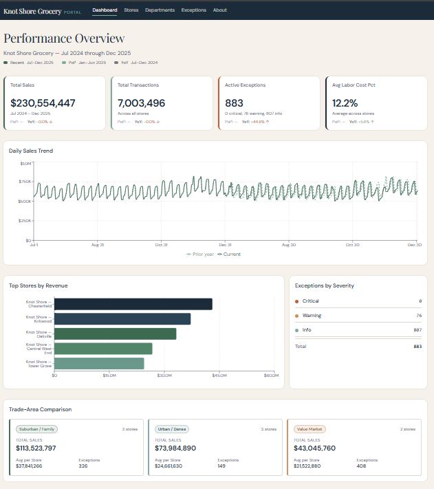
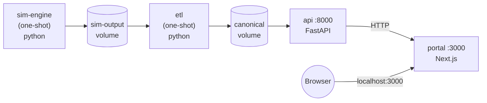
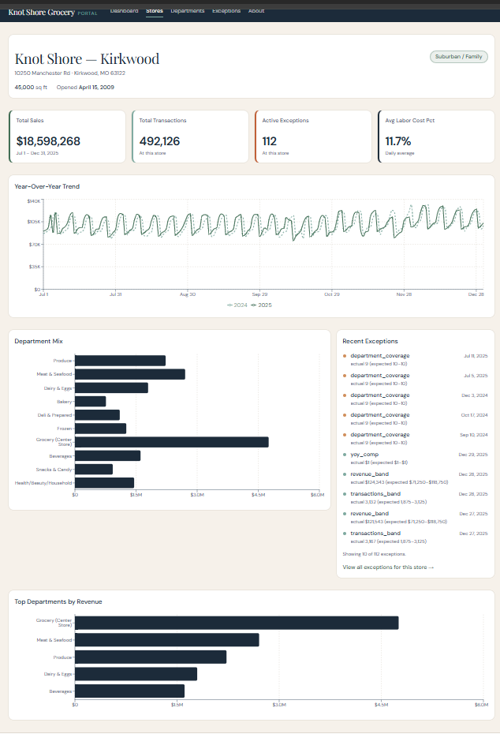
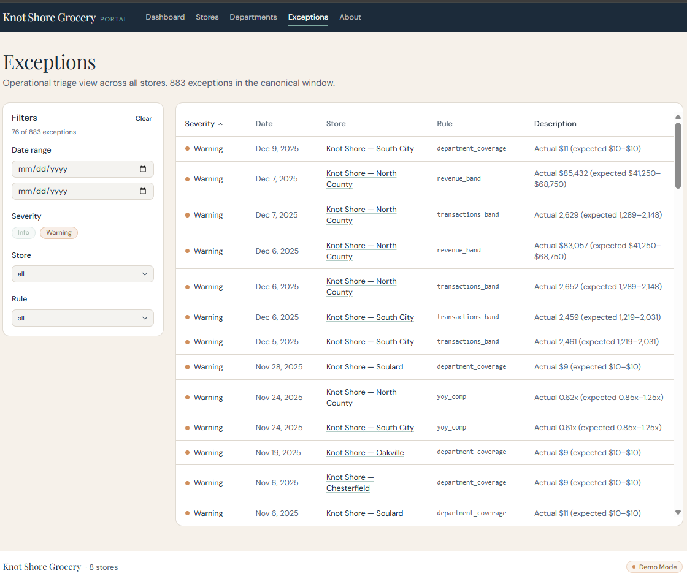
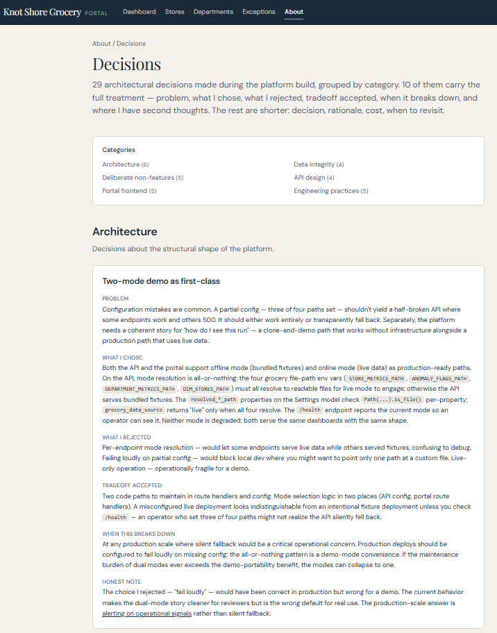

# Knot Shore Grocery Platform

End-to-end retail analytics platform for a fictional 8-store grocery chain.
Four independently maintained services — a deterministic simulation engine,
an ETL with anomaly detection, a FastAPI service, and a Next.js portal —
wired together into a single `docker compose up` demonstration.

- **One-command run.** Clone with submodules, `docker compose up`, open
  `http://localhost:3000`. The platform generates 18 months of synthetic data,
  runs the canonical pipeline, and serves the resulting dashboards from a run
  produced during that compose, not from a pre-built snapshot.
- **Deterministic pipeline, byte-identically.** Same seed and same date
  produces byte-identical sim output, byte-identical canonical parquets, and
  byte-identical API responses. Verified mechanically in the upstream test
  suites.
- **Detection across three rule kinds.** Five static-band rules over
  store-day metrics (`revenue_band`, `labor_pct_band`, `avg_ticket_band`,
  `transactions_band`, `yoy_comp`), one rolling-baseline rule
  (`revenue_zscore_28d`) that catches gradual drift the static bands miss,
  and one structural-integrity rule (`department_coverage`) that flags
  missing or duplicated department rows at department grain.
- **Dual-mode architecture treated as a contract.** The portal and the API
  each support an offline mode (bundled fixtures) and an online mode (live
  upstream) without code changes; this orchestration runs both in online
  mode end-to-end.
- **Cross-service correlation.** A single `X-Request-ID` threads from the
  portal through the API; structured JSON logs in both services share the
  same ID per user request.



## The platform

The platform is built around a fictional grocery chain — 8 stores in the
St. Louis metropolitan area, three trade-area profiles (`suburban-family`,
`urban-dense`, `value-market`), 10 departments per store, and 18 months of
daily operational data. The data is synthetic but realistic: per-store
baselines, day-of-week and seasonal variation, a four-year promotion
schedule, optional macro-economic multipliers from real FRED/BLS series, and
deliberate anomaly injection with a ground-truth log used downstream for
detection-quality measurement.

Four services form a one-direction pipeline. The simulation engine generates
CSV output for a paired-year window (a 184-day demo window in 2025 plus the
same calendar window in 2024 for year-over-year comparison). The ETL ingests
that output, normalizes into canonical parquet artifacts, and applies
detection rules. The API serves the canonical artifacts as JSON. The portal
consumes the API and renders three primary dashboards plus an architectural
documentation hub.

The engineering work this represents, in shortest form: schema discipline
at every boundary, deterministic regeneration verified by hash, a
detection vocabulary that extends to structural integrity, dual-mode
operation as a first-class production path rather than a development
convenience, and clean cross-repo contracts that let four services be
maintained, tested, and deployed independently.

## Quick start

Two prerequisites: Docker and Docker Compose v2 (the `docker compose`
subcommand, not the legacy `docker-compose` script).

Clone with submodules:

```bash
git clone --recursive https://github.com/Caseykelly87/knot-shore-platform.git
cd knot-shore-platform
```

If you cloned without `--recursive`, populate the submodules:

```bash
git submodule update --init
```

Bring the platform up:

```bash
docker compose up
```

The first run builds four images and takes roughly 2–4 minutes depending on
disk and network. Subsequent runs reuse cached layers and start in under a
minute.

Open `http://localhost:3000` for the portal, `http://localhost:8000/docs`
for the API's interactive documentation.

To stop the platform:

```bash
docker compose down
```

The canonical data persists in named volumes between runs. To discard it
and force a fresh pipeline run:

```bash
docker compose down -v
```

## Architecture



Two of the services are one-shot: `sim-engine` exits once it has written
the paired-year CSV output to the `sim-output` volume; `etl` exits once it
has written the four canonical parquet files to the `canonical` volume. The
two long-running services start in dependency order: `api` waits until the
ETL has exited successfully, then mounts the canonical volume read-only and
serves the parquets; `portal` waits until the API reports healthy, then
proxies requests to it.

The volumes are the contract between stages. `sim-output` is the CSV tree
the ETL consumes; `canonical` is the parquet set the API consumes. Each
volume is owned by exactly one writer and read by exactly one consumer.
Ports `8000` and `3000` are exposed to the host so the API docs and the
portal can be browsed directly.

The same image runs against bundled fixtures (offline) or against live
data (online); compose selects online mode by setting `API_MODE=online` on
the portal and the four `*_PATH` environment variables on the API. The
runtime image is identical between modes. This is the dual-mode contract
the platform treats as a first-class production path.

## Walkthrough

After `docker compose up` settles, the portal at `http://localhost:3000`
is the main surface. What a reviewer sees:

### Dashboard (`/`)


Platform-wide overview for the canonical 2025 demo window. KPI cards
(total sales, total transactions, average labor cost percentage), a
top-5-stores-by-revenue chart, a daily sales trend, and an exception
severity card showing counts at info / warning / critical levels. Totals
should match the integrity canaries documented in
[`/about/architecture`](http://localhost:3000/about/architecture):
`$115,253,718` total sales for the 2025 window across all 8 stores.

The page is a server component that fetches `/api/dashboard-summary` once
on load; the API computes the aggregations server-side rather than
shipping raw rows to the client.

### Store drilldown (`/stores/[id]`)



Per-store deep dive for any of the 8 stores. Numeric IDs 1 through 8;
invalid IDs render a `not-found` UI rather than a 500. KPI cards scoped
to that store, a year-over-year revenue chart that plots 2025 alongside
2024 from the paired-year canonical, a top-departments chart, a
department-mix breakdown, and a per-store anomalies card.

Store metadata (name, city, trade-area profile) comes from `/dim-stores`.
The page renders real store identification rather than synthesized labels;
`zip` and `county_fips` flow as zero-padded strings end-to-end.

### Departments

Cross-store department comparison. Net sales, transaction counts, units
sold, gross margin percentage at the store-day-department grain. The
canonical dataset contains 29,414 department-grain rows across the
paired-year window.

### Exceptions (`/exceptions`)



Operations-focused interface over the detection layer's flags. The
filter sidebar (severity, store, rule) is URL-synced via
`useSearchParams`, so `/exceptions?severity=warning&store=3` reproduces
the exact view, browser back/forward navigates filter history, and refresh
preserves filters.

The table sorts severity-first, then date-descending. Clicking a row opens
a detail sheet with a synthesized human-readable description composed from
the rule id, actual value, and expected band; the API doesn't ship a
description field, so the portal builds one client-side.

### About (`/about`)



The engineering perspective on the platform. Six sub-pages plus four
per-service deep dives:

- `/about/architecture` — platform-wide overview, including a mermaid
  data-flow diagram and the four properties the architecture optimizes
  for (explainability, deterministic regeneration, dual-mode operation,
  clean cross-repo contracts).
- `/about/decisions` — 28 architectural decisions across six categories,
  each with rationale, cost, and revisit conditions; the deeper entries
  carry problem / rejected / honest-note fields.
- `/about/lessons` — what broke during the build and what it taught.
- `/about/operations` — what would change to run this at production
  scale; the orchestration's [Production shape](#production-shape) section
  points here.
- `/about/sim-engine`, `/about/etl`, `/about/api`, `/about/portal` —
  per-service deep dives.

The about pages are static React Server Components; the mermaid diagrams
lazy-load mermaid from `cdn.jsdelivr.net` on mount rather than bundling
it.

## Engineering highlights

What a technical reviewer is most likely to find interesting, with
pointers into the depth in the about pages and service READMEs.

### Paired-year canonical, regenerable byte-identically

The canonical dataset is two paired 184-day windows: 2024-07-01 through
2024-12-31 and 2025-07-01 through 2025-12-31, the same eight stores in
each. The sim engine's per-date seeding (`global_seed + date.toordinal()`)
guarantees that a 2024-07-01 file produced by `backfill --start-date
2024-07-01` is byte-identical to a 2024-07-01 file produced by
`run --date 2025-07-01` (which generates the t-365 paired data alongside
its anchor).

That property propagates downstream. The ETL is byte-deterministic: same
sim output produces the same canonical parquets. The API serves those
parquets without transformation. The portal renders the same dashboards
across regenerations. Verification is mechanical: `cmp` between two
regenerations. The single most-asserted property in the platform's test
suite.

Depth: [`/about/decisions#per-date-deterministic-seeding`](http://localhost:3000/about/decisions),
the sim engine's [README](services/sim-engine/README.md#determinism).

### Detection that mixes band, baseline, and structural rules

The detection layer (in the ETL) evaluates seven rules across three
kinds. Five statistical-band rules over store-day metrics —
`revenue_band`, `labor_pct_band`, `avg_ticket_band`, `transactions_band`,
`yoy_comp` — check whether each day's value sits inside an expected
band. One rolling-baseline rule, `revenue_zscore_28d`, computes the
trailing 28-day mean and stddev of `total_sales` per store (current row
excluded, the same shape `yoy_comp` uses against T-365) and flags any
day whose `|z|` is at least 2.5; severity reads `|z|` directly with
buckets at 2.5–3 / 3–4 / ≥ 4. The rolling rule catches gradual drift
that sits inside the static bands but well outside the store's recent
distribution. One structural-integrity rule, `department_coverage`,
runs over the department-grain metrics and flags any store-day whose
department row count is not 10 or that carries a duplicated
`department_id`.

All three kinds of rule write to the same `anomaly_flags.parquet` with
the same schema. The portal's exceptions view doesn't care which kind a
flag came from. Band and baseline rules use the same `severity_score`
field (with kind-specific bucket cutoffs) and the structural rule emits
a fixed `severity_level`; the same per-rule filter UI surfaces all
three. The detection vocabulary is extensible: a new rule at any grain
plugs into the same evaluation pipeline.

Depth: ETL [README](services/etl/README.md#exception-detection),
[`/about/decisions`](http://localhost:3000/about/decisions) (the
detection category).

### Dual-mode operation as a contract

Both the API and the portal run in two modes: offline (bundled fixtures)
and online (live upstream). Neither mode is a degraded fallback. The API's
mode is detected per request from four `*_PATH` env vars — all four point
at readable parquet files for online; any missing or unreadable path
trips the whole grocery surface back to fixtures. The portal's mode is
read at module load from `API_MODE`.

A clone-and-run demo of the portal against bundled fixtures produces the
same dashboards as a live deployment against the API. This compose
orchestrates the online path end-to-end; the standalone portal and API
repos each work in offline mode without any other service running. The
mode is reported on each service's `/health` endpoint so silent fallback
to fixtures is detectable.

Depth: [`/about/decisions#two-mode-demo-as-first-class`](http://localhost:3000/about/decisions),
API [README](services/api/README.md#live-mode-vs-fixture-mode),
portal [README](services/portal/README.md#operating-modes).

### Schema discipline at every boundary

`zip` and `county_fips` flow as 5-character zero-padded strings from the
sim engine all the way through to the portal. They are identifiers;
arithmetic on them is meaningless and parsing them as integers loses
leading zeros for any value outside the current St. Louis dataset. The
sim engine writes them as strings, the ETL preserves them as strings, the
API serializes them as strings (a typed Pydantic v2 contract enforces
this), and the portal reads them as strings.

The pattern generalizes. The API's Pydantic schemas are themselves a form
of test: any service function returning data that doesn't match its
declared schema fails serialization, surfacing the contract violation at
the boundary rather than letting it leak into the dashboard. The ETL's
source-adapter / transform separation isolates format concerns from
business logic so that a future input format change (Google Sheets, real
production exports) is a drop-in adapter swap.

Depth: API [README](services/api/README.md#endpoints),
ETL [README](services/etl/README.md#the-grocery-pipeline).

### Cross-service request correlation

Every request to a portal `/api/*` route is tagged with a UUID, either
generated or accepted from the caller's `X-Request-ID` header. In online
mode the portal propagates the same ID to the API via the same header.
Both services bind the ID into their structured loggers' contextvars so
every log line emitted while handling the request includes it. A single
user's flow can be traced end-to-end by grepping one UUID across the two
services' logs.

Depth: portal [README](services/portal/README.md#request-correlation),
API [README](services/api/README.md#request-correlation).

## Production shape

This platform is configured for portfolio demonstration. The orchestration
brings up all four services on a single command and runs the full pipeline
locally, but the production-shape concerns — a real database for the
macro pipeline, a scheduler for canonical regeneration, an authentication
boundary, a monitoring stack with alerts, a deploy strategy with rollback,
data-quality checks at pipeline boundaries — are documented separately
rather than running locally.

See [`/about/operations`](http://localhost:3000/about/operations) for what
would change at scale, layer by layer. Each gap is named as a deliberate
non-feature so the scope is visible rather than implicit.

The compose file in this repo deliberately keeps the macro pipeline out
of scope: the API's `DB_*` env vars point at `127.0.0.1` so the macro
probe in `/health` fails fast without DNS stalls, and the API serves the
grocery pipeline normally while reporting macro as unavailable. This is
the documented "degraded" path; see the [Troubleshooting](#troubleshooting)
section for what that looks like in the logs.

## Service repositories

Each submodule is its own repository with its own CI, tests, and
README. Submodule pointers track each subrepo's `dev` branch tip,
so `git submodule update --remote` advances each service to its
latest reviewed work. Editing a service means committing in that
repo first, then updating the orchestration's submodule reference.

| Service | Path | Repository |
|---|---|---|
| Simulation engine | [`services/sim-engine`](services/sim-engine) | [knot-shore-grocery-simulation-engine](https://github.com/Caseykelly87/Knot-shore-grocery-simulation-engine) |
| ETL | [`services/etl`](services/etl) | [economic-data-etl](https://github.com/Caseykelly87/economic-data-etl) |
| API | [`services/api`](services/api) | [economic-data-api](https://github.com/Caseykelly87/economic-data-api) |
| Portal | [`services/portal`](services/portal) | [knot-shore-portal](https://github.com/Caseykelly87/knot-shore-portal) |

Brief role of each:

- **Simulation engine** — deterministic synthetic data generator. Produces
  store-day summaries and department-grain detail as CSV under
  `output/daily/{MM}/{DD}/{YYYY}/` for the paired-year window, plus a
  ground-truth `anomaly_log.csv` used downstream only for measuring
  detection quality (not for detection itself). 138 tests; the single
  most important asserts byte-identity across successive runs of the same
  seed.
- **ETL** — two pipelines in one repo. The grocery pipeline ingests the
  sim engine's CSV output, validates schema and referential integrity,
  runs the six detection rules, and writes four canonical parquets. The
  macro pipeline ingests FRED / BLS / USDA ERS series into SQLite by
  default (Postgres via `DATABASE_URL`); not exercised by this compose.
  271 tests across both pipelines, no live API or DB calls in the suite.
- **API** — FastAPI service that serves the canonical parquets as JSON.
  Five grocery endpoints (`/store-metrics`, `/department-metrics`,
  `/anomalies`, `/dashboard-summary`, `/dim-stores`) plus the macro
  endpoints that this compose leaves unavailable. Pydantic v2 schemas
  enforce response contracts. 142 tests, all isolated from live
  databases.
- **Portal** — Next.js 14 App Router application. Three primary pages
  (dashboard, store drilldown, exceptions) plus the eight-page about
  section. Server components for data fetching, recharts for charts (v2
  pinned), URL-synced state via `useSearchParams`. 196 tests covering
  pure logic and infrastructure boundaries; presentational components
  are visually reviewed rather than DOM-tested.

## Troubleshooting

Real issues observed during platform verification.

### First build is slow

The first `docker compose up` builds four images from scratch. On a
typical workstation this takes 2–4 minutes, most of it pip and pnpm
installs in the service layers. Subsequent rebuilds use Docker's layer
cache and are much faster. If only one service changed, only its image
rebuilds.

### Clean restart

Volumes persist across `docker compose down`. To force a fresh pipeline
run — re-running the simulation engine and re-deriving the canonical
parquets:

```bash
docker compose down -v
docker compose up
```

The `-v` flag removes the `sim-output` and `canonical` named volumes.
The next `up` regenerates them. Determinism guarantees the regenerated
parquets are byte-identical to the previous run.

### Google Fonts fallback

The portal's build downloads its display fonts from `fonts.gstatic.com`.
If the build environment cannot reach that host (firewall, offline
build, transient DNS), Next.js builds with system fallback fonts
instead. The portal still works; typography differs slightly from the
reference rendering. No action required: the fallback path is the
documented Next.js behavior.

### `/health` reports `degraded`

The API attempts to probe macro database availability on every `/health`
call. This compose deliberately doesn't run a Postgres for the macro
pipeline: `DB_HOST` is set to `127.0.0.1` so the probe fails immediately
rather than stalling on DNS. The API logs the connection failure once
per probe, and `/health` reports:

```json
{
  "status": "degraded",
  "grocery_pipeline": { "status": "healthy", "mode": "online" },
  "macro_pipeline": { "status": "unavailable", "reason": "database unreachable" }
}
```

This is expected. The grocery pipeline serves normally (HTTP 200); only
the macro side is unavailable. The compose file's comments document the
choice in more detail.

## Development

Each submodule is independently cloneable, testable, and deployable.
Working on a service:

1. Edit inside the submodule directory (`services/<name>`). The
   submodule is a real git checkout of the service repo, on whatever
   commit the orchestration pins.
2. Commit and push from inside the submodule, on a branch in the service
   repo.
3. Once the service-side change merges, update the submodule pin in this
   repo:
   ```bash
   git submodule update --remote services/<name>
   git add services/<name>
   git commit -m "chore(submodule): bump <name> to <short-sha>"
   ```

The pin is a specific commit, not a branch tracking ref. This keeps the
orchestrated platform deterministic: a `git checkout` at any point in
this repo's history brings up the exact set of service commits that were
working together at that time.

The orchestration repo itself carries no application code, only the
Dockerfiles, the compose file, and this documentation. The service
repos themselves carry no orchestration-specific files; the build
contexts in `compose.yml` point at the dockerfiles in this repo's
`docker/` directory.
